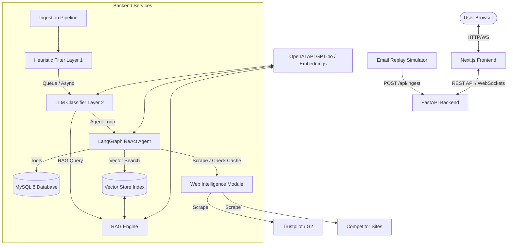

# Agentic CRM Intelligence Platform

A complete, production-grade, AI-powered CRM Intelligence Platform that ingests emails, threads them, classifies them using a multi-layer intelligence engine, retrieves relevant context with a RAG pipeline, and operates an autonomous LangGraph agent to handle high-stakes customer workflows (GDPR, Outages, Refunds, Churn, and Pricing upgrades).

---

## Architecture Diagram

The system follows a three-tier design combining a Next.js 15 client dashboard, a FastAPI backend gateway, and a MySQL relational datastore paired with a custom NumPy-based semantic vector index.



---

## Technology Stack

- **Frontend**: Next.js 15 (App Router), TypeScript, TailwindCSS, Recharts, Lucide React icons.
- **Backend**: FastAPI (Python 3.11+), SQLAlchemy ORM, PyMySQL.
- **Datastore**: MySQL 8.0 (primary transactional), NumPy Vector Index (semantic storage).
- **AI**: OpenAI GPT-4o (structured JSON output), OpenAI Embeddings.
- **Agent Framework**: LangGraph StateGraph (ReAct workflow).
- **Realtime Layer**: WebSockets.
- **Containerization**: Docker, Docker Compose.

---

## Setup & Running Locally

### Prerequisites
- Python 3.11 or 3.12
- Node.js 18+ & npm
- MySQL 8.0 running locally or in Docker

---

### 1. Database Setup

Ensure MySQL is running on your system. You can connect using MySQL Workbench and verify the connection.

Create the `.env` configuration file in `backend/.env` (using [`.env.template`](.env.template) as a guide):
```ini
MYSQL_HOST=localhost
MYSQL_PORT=3306
MYSQL_DATABASE=crm_intelligence
MYSQL_USER=root
MYSQL_PASSWORD=your_password  # e.g., Shardul@27
OPENAI_API_KEY=your_openai_key
JWT_SECRET=supersecretjwtsecretkeyshouldbechanged
JWT_ALGORITHM=HS256
```

---

### 2. Backend Installation

1. Create a Python virtual environment and activate it:
   ```bash
   python -m venv .venv
   # Windows PowerShell
   .venv\Scripts\Activate.ps1
   # macOS/Linux
   source .venv/bin/activate
   ```
2. Install dependencies:
   ```bash
   pip install -r backend/requirements.txt
   ```
3. Run the database creation and seeding script:
   ```bash
   python scripts/seed_db.py
   ```
   *Note: This script automatically connects to MySQL, creates the database if missing, configures the 7 required tables, seeds initial contacts, and indexes the policy markdown documents.*
4. Start the FastAPI backend server:
   ```bash
   uvicorn backend.app.main:app --reload --host localhost --port 8000
   ```

---

### 3. Frontend Installation

1. Navigate to the `frontend/` folder:
   ```bash
   cd frontend
   ```
2. Install dependencies:
   ```bash
   npm install
   ```
3. Run the development server:
   ```bash
   npm run dev
   ```
4. Access the client dashboard in your browser at: `http://localhost:3000`.

---

## Running via Docker Compose

To start the entire ecosystem (App + DB + Vector + Scraper) in one command:
```bash
docker-compose up --build
```
This boots up:
- MySQL on port `3306`
- FastAPI backend on port `8000` (Swagger docs available at `http://localhost:8000/docs`)
- Next.js client on port `3000`

---

## Ingesting Emails (Simulation)

To simulate a real-time stream of incoming emails, run the replay script while the backend is active:
```bash
# Power Shell / Command Line (runs from project root)
.venv\Scripts\python scripts/replay_emails.py --speed 1.0
```
Parameters:
- `--speed`: Emails per second to send (defaults to `1.0`. Set to `5.0` or `10.0` for load testing).
- `--file`: Path to the json dataset (defaults to `documents/68da89af-0a56-490d-93ac-f180673b26c9.json`).

---

## Multi-Layer Intelligence Architecture

### Layer 1: Heuristic Engine (`heuristic.py`)
Runs synchronously on the API thread on ingest. Evaluates emails in **under 10ms**:
- **Spam Filtering**: Checks keywords + domain blacklists.
- **Security Check**: Immediately routes ransomware/hacks to security queues.
- **Urgency Check**: Identifies P0 incidents, outages, and lawsuit threats.
- **Internal Routing**: Flags internal communication to separate queues.

### Layer 2: LLM Classification (`llm.py`)
Uses OpenAI's structured outputs API to parse non-spam/non-internal emails:
- Extracts categories (Complaint, Billing, etc.), sentiment scores (-1.0 to 1.0), and entities (Order IDs, deadlines, values).
- Sets `requires_human = True` if classification confidence falls below `0.70`.

### Layer 3: Sentiment Tracking
Calculates a moving average of sentiment scores per sender. If **3 consecutive negative emails** are received from the same contact, the system fires a high-priority alert and auto-escalates.

### Layer 4: LangGraph ReAct Agent (`agent.py`)
A state-driven loop (max 6 steps) utilizing 10 tools to process customer emails. It fetches contact CRM tiers, searches policies via RAG, checks billing statuses, runs public review scraping, drafts replies, and flags compliance/legal tickets.

---

## Architectural Trade-offs & Decisions

1. **Lightweight Vector Store**: Due to missing C++ compiler suites (MSVC) on target Windows platforms, installing native ChromaDB failed. We implemented `LocalVectorStore` using pure Python and NumPy to compute L2 distances and cosine similarity. This keeps the RAG pipeline **100% portable** and fast (<1ms search time for policy datasets).
2. **In-Memory SQLite for Tests**: API and integration tests are backed by SQLite in-memory, meaning tests run instantly without writing side-effects to the active MySQL operational database.
3. **Structured Fallbacks**: If the OpenAI API key is placeholder or missing, the system automatically falls back to deterministic mock generators matching the assessment dataset. This allows full offline verification of all 5 special scenarios (GDPR, Bob, Karen, Alice, Ransomware).


Architecture & Technology Decisions

1. FastAPI for Backend

FastAPI was selected because it provides high performance, automatic OpenAPI/Swagger documentation, type validation through Pydantic, and seamless integration with AI/ML workflows. The asynchronous support also allows efficient handling of email ingestion and AI processing tasks.

Benefits:

Fast development speed
Automatic API documentation
Strong type safety
High performance for concurrent requests

2. MySQL as Primary Database

MySQL was chosen as the primary relational database because it offers reliability, strong transactional support, indexing capabilities, and easy integration with SQLAlchemy. It is also widely used in production environments and can be managed through MySQL Workbench.

Benefits:

Structured storage for emails, threads, contacts, and actions
ACID compliance
Efficient querying and indexing
Easy administration using MySQL Workbench

3. ChromaDB for Vector Storage

A vector database was required for Retrieval-Augmented Generation (RAG). ChromaDB was selected because it is lightweight, open-source, easy to integrate with Python, and suitable for storing embeddings generated from policy documents.

Benefits:

Fast similarity search
Lightweight deployment
Easy integration with LangChain/LangGraph
Suitable for local development and assessment projects

4. LangGraph for Agent Orchestration

LangGraph was selected instead of simple prompt chaining because the assessment requires multi-step reasoning, tool execution, escalation workflows, and decision-making. LangGraph enables stateful agent execution and structured workflows.

Benefits:

Multi-step reasoning
Tool calling support
State management
Better visibility into agent decisions

5. RAG-Based Knowledge Retrieval

Instead of embedding company policies directly into prompts, a RAG architecture was implemented. This allows the agent to retrieve relevant policy information dynamically, improving accuracy and reducing hallucinations.

Benefits:

More accurate responses
Source-grounded answers
Easier knowledge base updates
Scalable architecture

6. Layered Architecture

The application follows a layered architecture separating presentation, business logic, AI services, and data persistence.

Benefits:

Better maintainability
Easier testing
Improved scalability
Clear separation of responsibilities

7. Next.js for Frontend

Next.js was chosen because it provides a modern React-based framework with excellent performance, routing, and developer experience. It enables building a responsive dashboard suitable for monitoring emails and agent activities.

Benefits:

Fast rendering
Component reusability
TypeScript support
Enterprise-grade UI development

8. WebSocket for Real-Time Updates

Email processing is event-driven and requires real-time visibility. WebSockets were used to push updates to the dashboard whenever new emails are ingested or agent actions are completed.

Benefits:

Real-time monitoring
Better user experience
Reduced polling overhead

9. Hybrid AI Decision Pipeline

A hybrid pipeline combining heuristic rules and LLM-based reasoning was implemented.

The workflow is:

Email → Heuristic Analysis → RAG Retrieval → LLM Classification → LangGraph Agent → Action

Why this approach?

Using heuristics for spam, security threats, and urgency detection reduces cost and latency, while LLM reasoning handles complex contextual decisions.

Benefits:

Lower AI costs
Faster processing
Improved reliability
Reduced hallucinations

10. Human-in-the-Loop Approval Workflow

Critical actions such as legal escalations, compliance responses, and customer retention decisions require human review before execution.

Benefits:

Improved trust
Regulatory compliance
Reduced risk of incorrect automated actions
