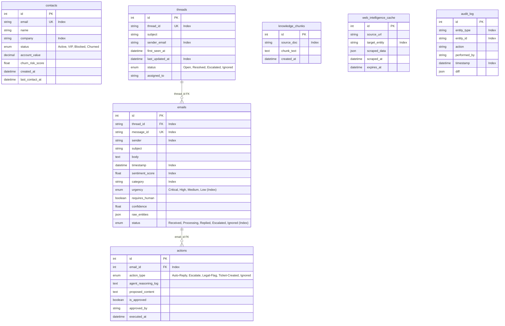

# Database Entity Relationship (ER) Diagram

This diagram outlines the relationships and constraints within the Agentic CRM Intelligence Platform's MySQL database.

```mermaid
erDiagram
    contacts {
        int id PK
        string email UK "Index"
        string name
        string company "Index"
        enum status "Active, VIP, Blocked, Churned"
        decimal account_value
        float churn_risk_score
        datetime created_at
        datetime last_contact_at
    }

    threads {
        int id PK
        string thread_id UK "Index"
        string subject
        string sender_email "Index"
        datetime first_seen_at
        datetime last_updated_at "Index"
        enum status "Open, Resolved, Escalated, Ignored"
        string assigned_to
    }

    emails {
        int id PK
        string thread_id FK "Index"
        string message_id UK "Index"
        string sender "Index"
        string subject
        text body
        datetime timestamp "Index"
        float sentiment_score "Index"
        string category "Index"
        enum urgency "Critical, High, Medium, Low (Index)"
        boolean requires_human
        float confidence
        json raw_entities
        enum status "Received, Processing, Replied, Escalated, Ignored (Index)"
    }

    actions {
        int id PK
        int email_id FK "Index"
        enum action_type "Auto-Reply, Escalate, Legal-Flag, Ticket-Created, Ignored"
        text agent_reasoning_log
        text proposed_content
        boolean is_approved
        string approved_by
        datetime executed_at
    }

    knowledge_chunks {
        int id PK
        string source_doc "Index"
        text chunk_text
        datetime created_at
    }

    web_intelligence_cache {
        int id PK
        string source_url
        string target_entity "Index"
        json scraped_data
        datetime scraped_at
        datetime expires_at
    }

    audit_log {
        int id PK
        string entity_type "Index"
        string entity_id "Index"
        string action
        string performed_by
        datetime timestamp "Index"
        json diff
    }

    threads ||--o{ emails : "thread_id FK"
    emails ||--o{ actions : "email_id FK"
```
